# Re:Earthチュートリアル「ル・コルビジェのアーカイブ」
## 概要
.jpg)
ル・コルビジェ（1887〜1965）は、モダニズム建築の巨匠として、主にフランスで活躍したスイス人建築家です。その作品群は、「ル・コルビジェの建築作品-近代建築運動への顕著な貢献-」として、世界遺産に登録されています。  
今回のチュートリアルでは、この作品群と経歴のデジタルアーカイブを制作します。

## 流れ
ル・コルビジェの建築作品と経歴をマッピングする。  
    
1. マーカーを配置する
2. フォトオーバーレイを設定する  
3. ストーリーテリングを設定する
4. 背景地図を変更する
5. 公開設定を行う

## 素材
世界遺産『ル・コルビジェの建築作品-近代建築運動への顕著な貢献-』
[https://docs.google.com/spreadsheets/d/1p3JKhLPQ-Vjnqb5NVsVcp7sDCUybnUEbBBnf76IbJYo/edit?usp=sharing](https://docs.google.com/spreadsheets/d/1p3JKhLPQ-Vjnqb5NVsVcp7sDCUybnUEbBBnf76IbJYo/edit?usp=sharing)


## 1. 新規プロジェクトの作成
### 1.1. トップページを開く
[https://app.reearth.io/](https://app.reearth.io/)からトップページを開き、`新規プロジェクト`のボタンをクリックしてください。  
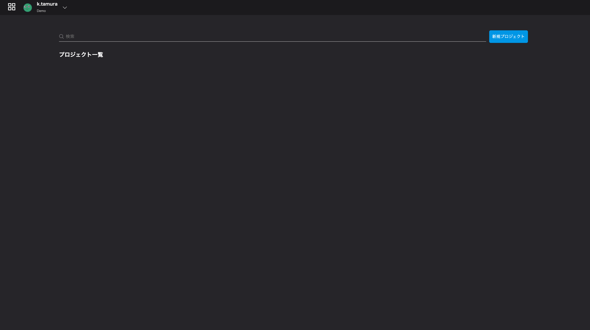  

### 1.2. 新規プロジェクトの作成
プロジェクト名とプロジェクト概要を入力してください。  
 
> プロジェクト名：ル・コルビジェの建築アーカイブ  
> プロジェクト概要：デモ用として、ル・コルビジェの建築アーカイブを作成します。    

入力が完了したら、`作成`ボタンをクリックしてください。  

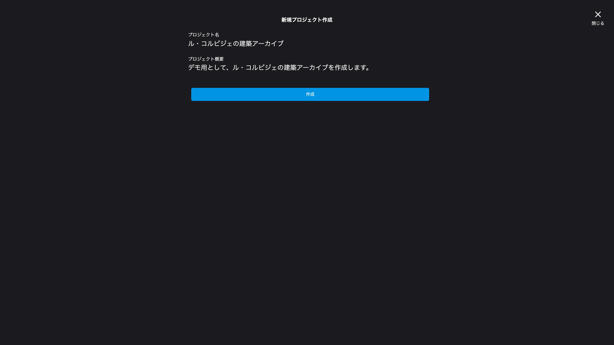  

作成した新規プロジェクトは、プロジェクト一覧に追加されます。  
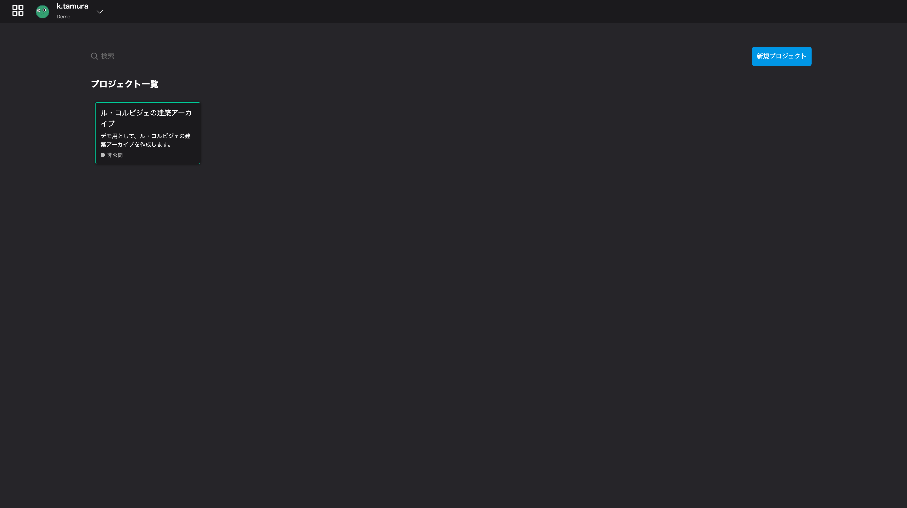  

### 1.3. アプリケーションを開いてみましょう  
さきほど作成した、新規プロジェクトのカードをクリックしてください。  
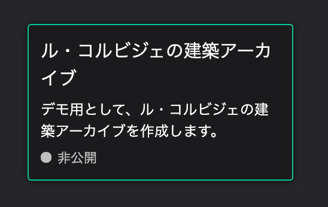  

すると、編集画面が開きます。この画面から、データの作成と編集を行っていきます。 
  

### 1.4. デジタルアースの基本操作
| 操作 | Windows | Mac |
| :--- | :--- | :--- |
| 左へ移動 | マウスもしくはトラックパッドから左クリックで右方向にドラッグ | マウスもしくはトラックパッドから右クリックでドラッグ |
| 右へ移動 | マウスもしくはトラックパッドから左クリックで左方向にドラッグ | マウスもしくはトラックパッドから左クリックで左方向にドラッグ |
| 上へ移動 | マウスもしくはトラックパッドから左クリックで下方向にドラッグ | マウスもしくはトラックパッドから左クリックで下方向にドラッグ |
| 下へ移動 | マウスもしくはトラックパッドから左クリックで上方向にドラッグ | マウスもしくはトラックパッドから左クリックで上方向にドラッグ |
| 時計回りに回転 | - | **Control**キーを押しながら、マウスもしくはトラックパッドから左クリックで左方向にドラッグ |
| 反時計回りに回転 | - | **Control**キーを押しながら、マウスもしくはトラックパッドから左クリックで右方向にドラッグ |
| ローアングルにする | - | **Control**キーを押しながら、マウスもしくはトラックパッドから左クリックで上方向にドラッグ |
| ハイアングルにする | - | **Control**キーを押しながら、マウスもしくはトラックパッドから左クリックで下方向にドラッグ |
| 視点の中心部をずらす | - | **Shift**キーを押しながら、マウスもしくはトラックパッドから左クリックで任意の方向にドラッグ |
| ズームイン | - | 右クリックのまま下方向へドラッグorマウスホイールを手前へ回転 |
| ズームアウト | - | 右クリックのまま上方向へドラッグorマウスホイールを奥へ回転 |


デジタルアースを回転させたり、ズームイン/アウトなどの基礎操作を行ってみましょう。

### ズームイン・ズームアウト
マウス

- ズームイン: 右クリックのまま下方向へドラッグorマウスホイールを手前へ回転
- ズームアウト: 右クリックのまま上方向へドラッグorマウスホイールを奥へ回転

トラックパッド  

- ズームイン: 二本指で、上方向に向けてスワイプ
- ズームアウト: 二本指で、上方向に向けてスワイプ


### アングルを変更し、丘や山を表示する
マウス

- アングルの変更: **Control**キーを押しながら上下にドラッグ操作

トラックパッド  
-アングルの変更: **Control**キーを押しながら上下にドラッグ操作


### 視点の移動

マウス

- デジタルアースの回転: 左クリックでドラッグ
- ズームイン: 右クリックのまま下方向へドラッグorマウスホイールを手前へ回転
- ズームアウト: 右クリックのまま上方向へドラッグorマウスホイールを奥へ回転
- 視点の中心部を変更: **Shift**キーを押しながらドラッグ操作

トラックパッド  

- デジタルアースの回転: 一本指でドラッグ
- ズームイン: 二本指で、上方向に向けてスワイプ
- ズームアウト: 二本指で、上方向に向けてスワイプ
- 視点の中心部を変更: **Shift**キーを押しながらドラッグ操作


## 2.マーカーのデザイン
### 2.1 マーカーを地図の上に載せる
上部バー左側にある`マーカー`のアイコンを、地図上にドラッグ＆ドロップしてください。  
  

### 2.2 マーカーを編集する
  
右パネル左端の`レイヤー`タブ内`マーカー`から、マーカーの設定を編集することができます。   
  
    
- 位置: マーカーの場所を緯度経度で設定できます。
- 高度: マーカーの高さを設定できます。
- 表示方法: ポイントマーク/画像アイコンの切り替えができます。
- ポイント色: ポイントマークの色を設定できます。
- ポイントサイズ: ポイントマークの大きさを設定できます。
- ラベル: ポイントマークにラベルを設定することができます。
- 地面から線を伸ばす: 高度を設定している場合、地表からポイントマークまでの線を表示することができます。
  

ポイントの色とサイズを変更してみます。  


### 2.3 マーカーを画像アイコンにする
マーカーに、ル・コルビジェの画像を設定します。  

画像URL: [https://upload.wikimedia.org/wikipedia/commons/thumb/c/c8/Le_Corbusier_%281964%29.jpg/480px-Le_Corbusier_%281964%29.jpg](https://upload.wikimedia.org/wikipedia/commons/thumb/c/c8/Le_Corbusier_%281964%29.jpg/480px-Le_Corbusier_%281964%29.jpg)

`表示方法: アイコン`を選択すると以下の項目が表示されます。
  

- 画像URL: 画像をアップロードすることができます。
- 画像サイズ: 画像のサイズを設定できます。
- 切り抜き: 画像をそのまま表示するか、丸く切り抜くかが選択できます。
- シャドウ: 画像アイコンに影を付与できます。ONにするとシャドウの設定項目が表示されます。
- シャドウ色: 影の色を設定できます。
- シャドウ半径: 影の大きさを設定できます。
- シャドウX: 影の、縦方向の位置を設定できます。
- シャドウY: 影の、横方向の位置を設定できます。
  
  

### 2.4 マーカーの位置を移動させる
`位置`を設定して、マーカーを国立西洋美術館の位置に移動させましょう。  
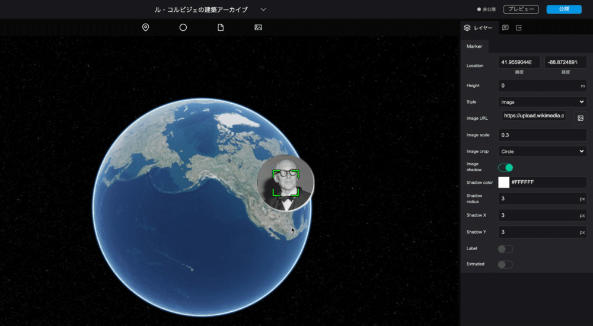

国立西洋美術館の緯度経度  
>緯度: 35.715415
>経度: 139.775844

※住所や地名から緯度経度を調べるには、日本国内であれば地理院地図、日本国外であればGoogle Mapなどが便利です。

### 2.5 マーカーの名前設定
Re:Earthでは、マーカー・フォトオーバーレイ・球体ツールなどで作成したデータををまとめて「レイヤー」と呼びます。
左側パネルは、このレイヤーを管理する部分と、シーンやウィジェットを管理する部分にわかれています。

デフォルトでは`マーカー`となっている表示名を、わかりやすいように、「国立西洋美術館」へ変更しましょう。
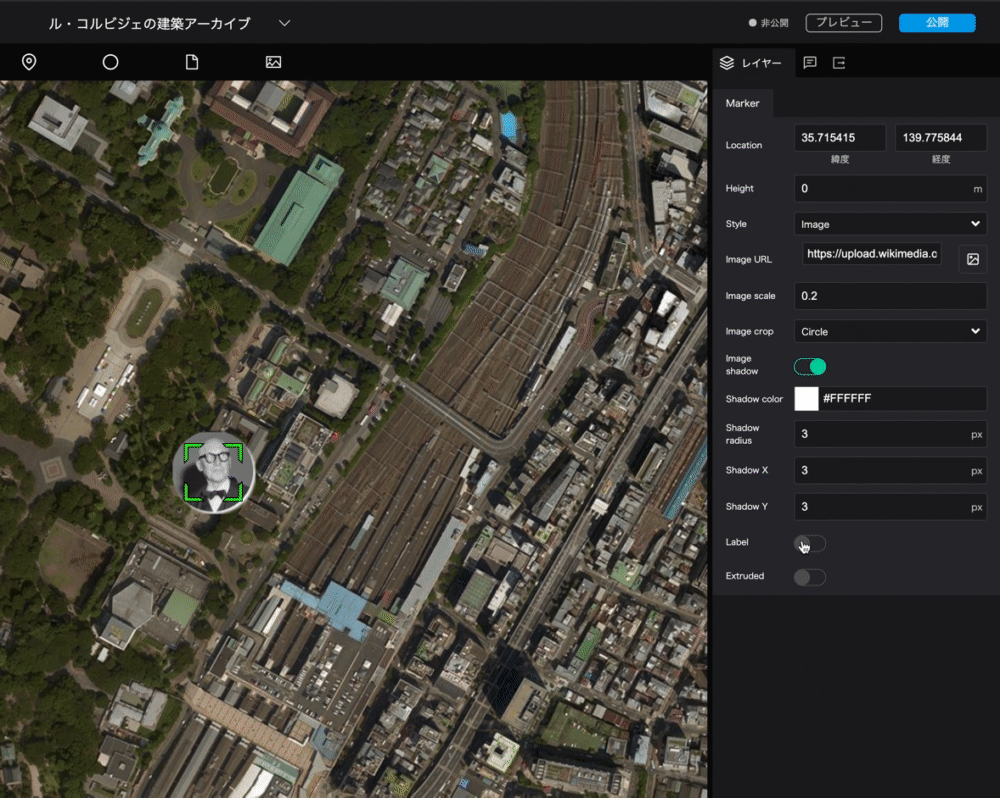

> マーカー → 国立西洋美術館

### 2.6 ラベルの追加
先ほど名前を変更した国立西洋美術館のマーカーに、ラベルを追加します。 
左パネルで設定したマーカー名は編集時の名前ですが、ラベルはアーカイブ公開時に表示される名前になります。

`ラベル`をONにすると、ラベルの設定項目が表示されます。  
表示された`ラベル文字`の欄に「国立西洋美術館」と入力してください。


  

- ラベル: マーカーにラベルを付与できます。ONにするとラベルの設定項目が表示されます。
- ラベル文字: ラベル名の設定ができます。
- ラベルフォント: フォント・行揃え・太字・斜体・下線の設定ができます。  

## 3. マーカーのインフォボックスを作成
### 3.1 
右パネル上部のタブを、現在の`レイヤー`から真ん中の`インフォボックス`へ切り替えます。  


### 3.2 新規インフォボックスの作成
`新規インフォボックス`ボタンをクリックすると、選択しているマーカーにインフォボックスが追加されます。  


### 3.3 インフォボックスのコンテンツを設定
表示されたインフォボックスの`＋`ボタンから、インフォボックスに埋め込むコンテンツを選ぶことができます。  
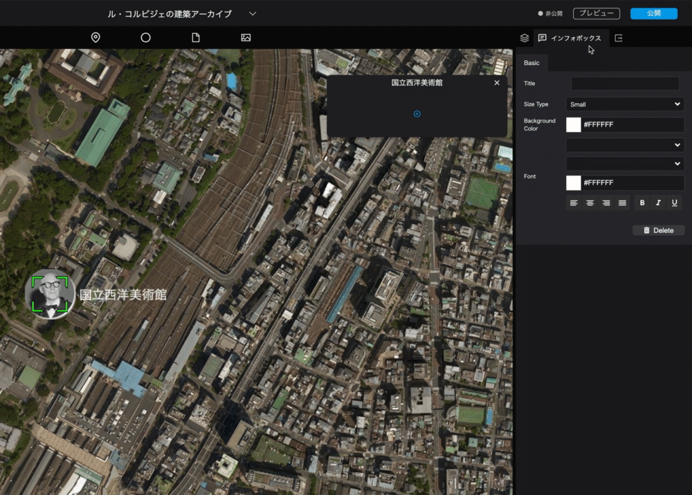

コンテンツ形式は、次の5種類から適切なものを選択してください。  

- Text: テキスト
- Image: 画像
- Video: 動画
- Location: 地図
- Table: 表
  
今回は、`Image`→`Text`→`Text`の順で選びましょう。  

### 3.4 画像コンテンツの設定
インフォボックス内の画像アイコンをクリックすると、画像のアップロード等を行うウィンドウが表示されます。  
 ## （アップロード機能がついたのでここ追記or差し替えお願いします！＞たむちゃん
`画像`に、表示させたい画像のURLを貼り付けてください。  
コルビジェの画像URL: [https://upload.wikimedia.org/wikipedia/commons/9/9d/National_museum_of_western_art05s3200.jpg](https://upload.wikimedia.org/wikipedia/commons/9/9d/National_museum_of_western_art05s3200.jpg)  

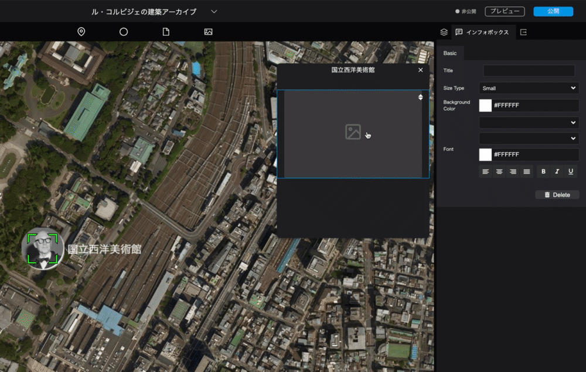

- フルサイズ: 画像を横幅最大まで拡大します。
- 画像サイズ: 画像のサイズを設定します。`カバー`では画像フレームにあわせて画像がトリミングされます。`含む`では画像の比率そのままに、フレームに収まるよう拡大・縮小が行われます。
- 水平位置: 画像の水平方向への配置を設定します。左寄せ・中央寄せ・右寄せを選ぶことができます。  
- 垂直位置: 画像の垂直方向への配置を設定します。上寄せ・中央寄せ・下寄せを選ぶことができます。  

### 3.5 テキストコンテンツの設定
インフォボックス内のテキストブロックをクリックすると、右パネルからテキストの設定が行えます。（※UI定まったら追記）  
今回は、2つのテキスト情報を入力しましょう。  
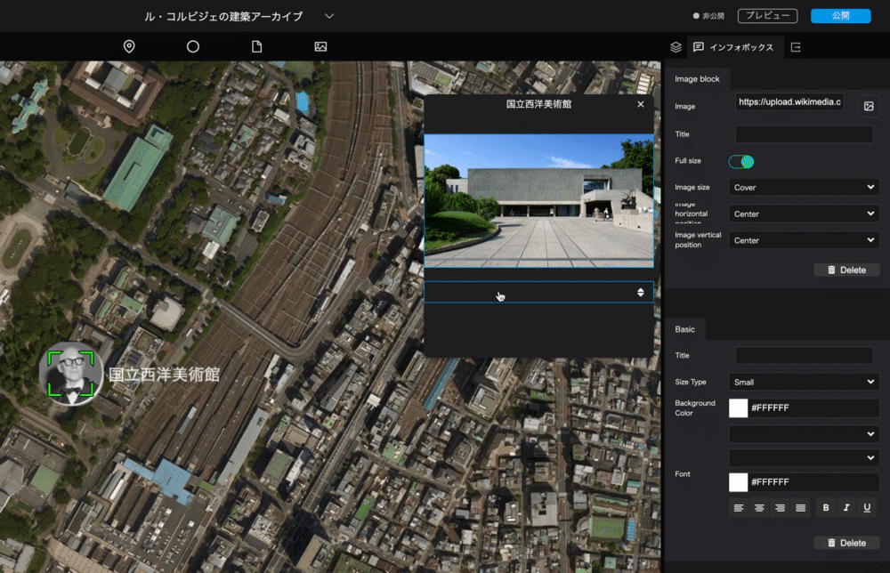

- 概要    
```
国立西洋美術館（1955年）は、東京都台東区に残る美術館で、ル・コルビジェが基本設計を担当した。
日本に残る唯一のル・コルビジェの建築というだけでなく、東アジアでも唯一である。  
国立西洋美術館は、フランスから松方コレクションが寄贈返還されるにあたり、その受け入れ先となる美術館の建設が必要となったことから実現した。
ル・コルビジェが指名された詳細な経緯は不明だが、1953年12月に日本で発足した「仮称フランス美術館設置準備協議会」では、フランス側の心証を良くするためにフランスの著名な建築家を起用することや、この機会に世界的建築家の作品を日本で実現したいといった意見が出ていたという。  
ル・コルビジェが契約していたのは美術館の基本設計のみで、具体的な寸法なども含めた実施設計は日本の坂倉準三、前川國男、吉阪隆正の3人が担当した。ル・コルビジェは生涯でただ一度となる日本訪問（1955年11月）を踏まえて、基本設計を行なった。
```
- 出典  
```
出典：Wikipedia
```
  
### 3.6 インフォボックスのデザイン
右パネル下部`インフォボックス`では、インフォボックス自体の大きさや背景色などを設定できます。  


## 4.デジタルアースの設定と公開
### 4.1 標高データの設定
左パネル上部の`シーン`を選択すると、デジタルアースに関する設定が行えます。  
今回は、標高データをオンにし、デジタルアースに地形の起伏を反映させてみましょう。  
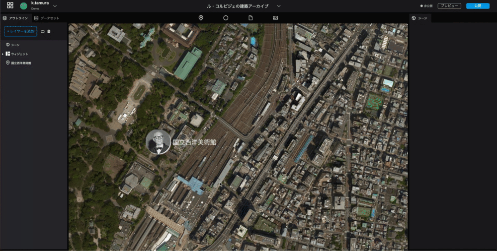  

1. キーボードの**Control**キーを押しながら、マウスもしくはトラックパッドで操作すると、デジタルアースの傾きを変更できます。
2. 左パネル上部の`シーン`を選択してください。
3. 右パネルに表示される`シーン`から、デジタルアースの設定ができるようになります。
4. `シーン`内`地形`のスイッチをクリックし、ONにしてください。標高データが読み込まれ、地形の起伏が表現されます。

### 4.2 カメラの設定
プロジェクトを公開した際、最初に表示されるカメラの位置を設定します。  
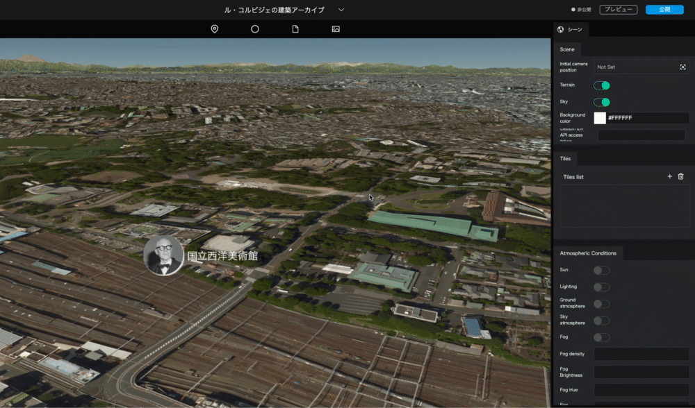     

1. 右パネル`シーン`にある`カメラ初期位置`をクリックします。
2. 地球儀を操作して、最初に表示させたいカメラの位置を探します。
3. カメラ位置が決まったら`キャプチャ`ボタンを押してください。その位置が、プロジェクト公開時の最初のカメラ位置となります。

### 4.3 公開設定
いよいよ公開です。  
右上の`公開`ボタンをクリックし、`限定公開`を選択して、右下の`公開`ボタンを押してください。
限定公開用のURLから、完成したアーカイブを確認することができます。
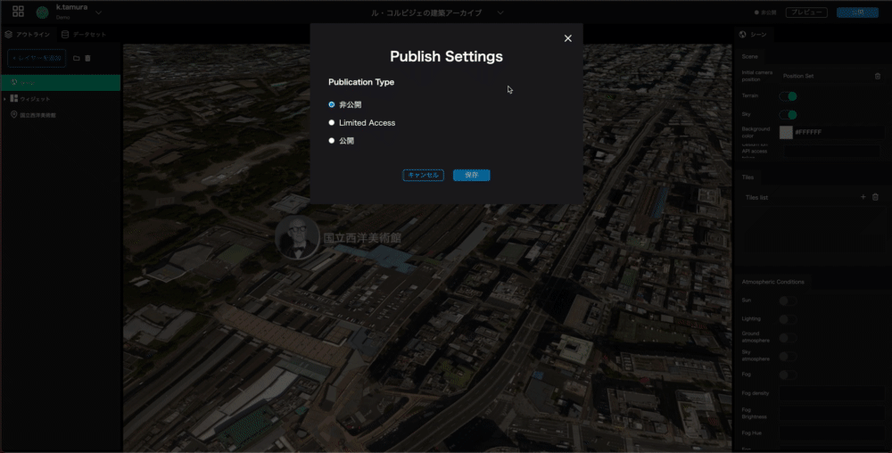  

  

### 4.4 データ追加
以下のスプレットシート内の建築一覧ファイルに、ル・コルビジェの他の建築物のデータが入っています。  
ぜひ、他のデータ追加も行ってみてください。  
スプレットシートURL: [https://docs.google.com/spreadsheets/d/1p3JKhLPQ-Vjnqb5NVsVcp7sDCUybnUEbBBnf76IbJYo/edit?usp=sharing](https://docs.google.com/spreadsheets/d/1p3JKhLPQ-Vjnqb5NVsVcp7sDCUybnUEbBBnf76IbJYo/edit?usp=sharing)

## 今後の予告
今回は、マーカーの配置・表現までを行いました。  
Re:Earthには、他にも様々な機能があります。  
次回は、**フォトオーバーレイ、ストーリーテリング、CSVデータの一括読み込みと編集**の3つを行っていきます。  
