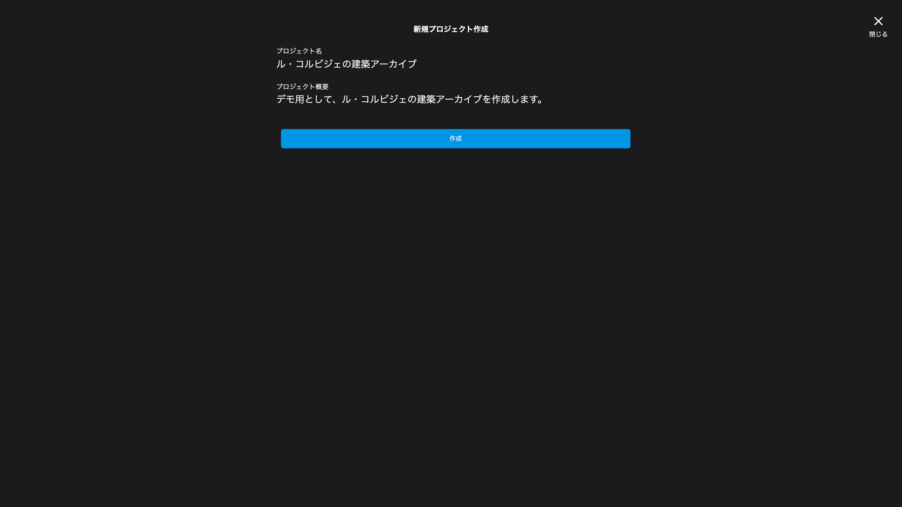
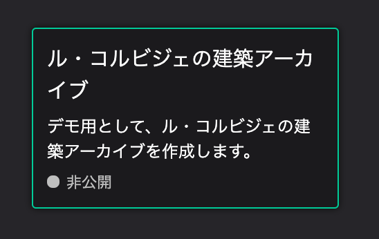
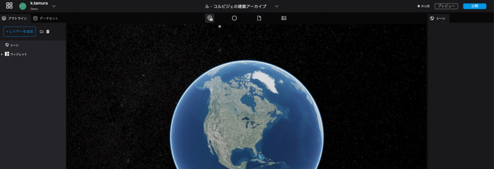
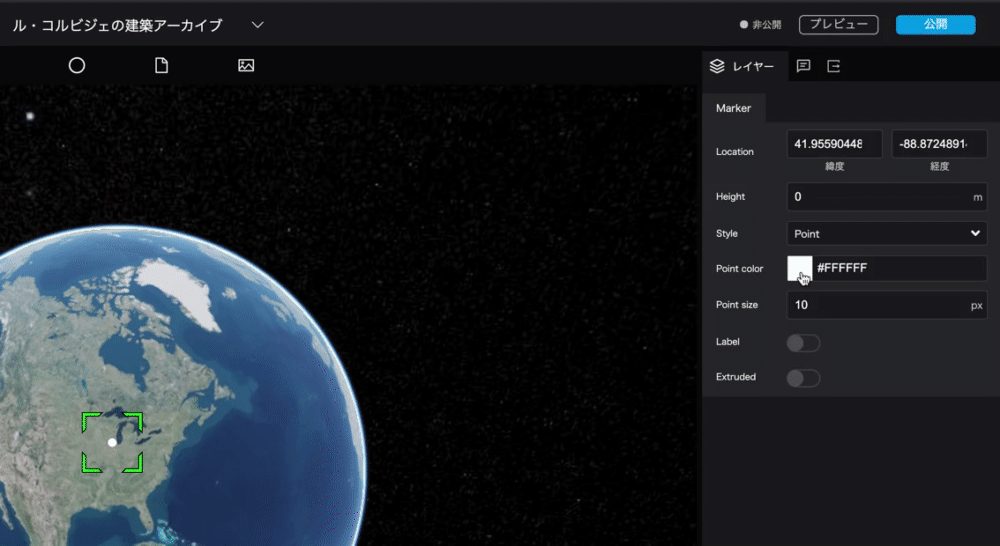
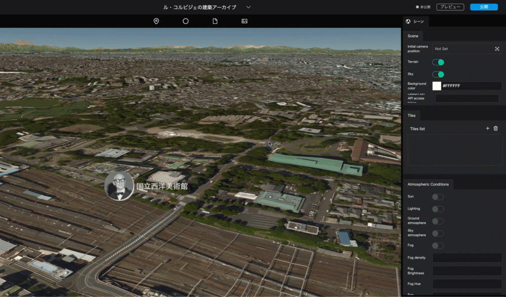
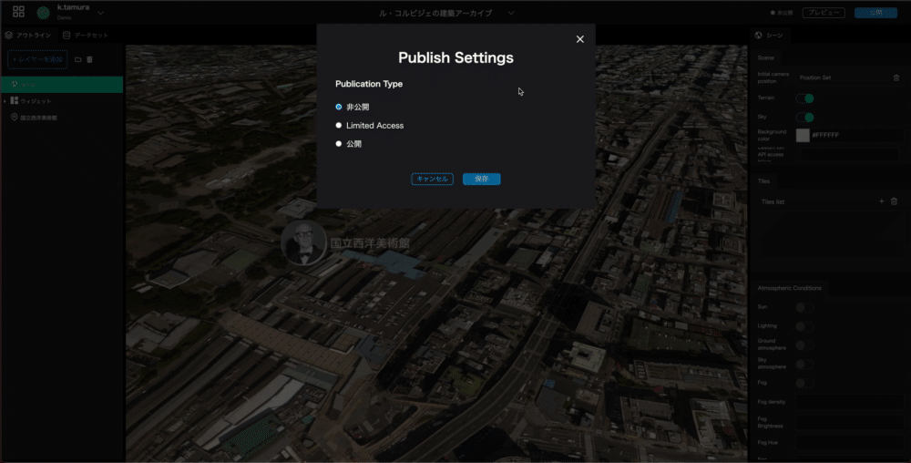

# Re:Earth Tutorial "Le Corbusier's Archive
## Overview
.jpg)
Le Corbusier (1887-1965) was a Swiss architect who worked mainly in France as a master of modernist architecture. His works are registered as a World Heritage Site as "Le Corbusier's Architectural Works - Outstanding Contribution to the Modern Architectural Movement".  
In this tutorial, we will create a digital archive of this body of work and his career.

## Flow
Mapping Le Corbusier's architectural works and career. 1.  
    
1. place the markers
2. set up a photo overlay  
3. set up storytelling
4. change the background map
5. set publication settings

## Material
World Heritage Site, "Le Corbusier's architectural work - an outstanding contribution to the modern architectural movement.

[https://docs.google.com/spreadsheets/d/1p3JKhLPQ-Vjnqb5NVsVcp7sDCUybnUEbBBnf76IbJYo/edit?usp=sharing](https://docs.google.com/spreadsheets/d/1p3JKhLPQ-Vjnqb5NVsVcp7sDCUybnUEbBBnf76IbJYo/edit?usp=sharing)


## 1. Create a new project
### 1.1. Open the top page
Open the top page from [https://app.reearth.io/](https://app.reearth.io/) and click on the `New Project` button.  
  

### 1.2. Create a new project
Enter a project name and a project summary.  
 
> Project Name: Le Corbusier's Architectural Archive  
> Project Summary: We will create an architectural archive of Le Corbusier for demonstration purposes.    

When you are done, click on the `Create` button.  

  

The new project you created will be added to the project list.  
  

### 1.3. Open the application  
Click on the card of the new project you just created.  
  

This will open the editing screen. From this screen, you can create and edit data. 
  


Let's perform basic operations such as rotating the digital earth and zooming in/out.

### Zoom in/out
Mouse

- Zoom in: right-click and drag down or rotate mouse wheel forward
- Zoom out: right click and drag up or rotate mouse wheel to the back

Trackpad  

- Zoom in: swipe upward with two fingers
- Zoom out: Swipe upward with two fingers


### Change the angle to show hills and mountains
Mouse

- Change angle: Hold down the **Control** key and drag up or down

Trackpad  
- Change angle: **Control** key and drag up/down.


### Moving the viewpoint

Mouse

- Rotate the digital earth: left click and drag
- Zoom in: right click and drag down or rotate mouse wheel forward
- Zoom out: right click and drag up or rotate mouse wheel back
- Change the center of the view point: Hold down the **Shift** key and drag

Trackpad  

- Rotate the digital earth: drag with one finger
- Zoom in: two fingers, swipe upward
- Zoom out: Two-finger upward swipe
- Change the center of the viewpoint: Hold down **Shift** and drag


## 2. Marker design
### 2.1 Putting the marker on the map
Drag and drop the `marker` icon on the left side of the top bar onto the map.  
  

### 2.2 Editing a marker
  
You can edit the marker settings from the `Markers' tab in the `Layers' tab on the left side of the right panel.   
  
    
- Location: Set the location of the marker in latitude and longitude.
- Altitude: Set the height of the marker.
- Display: You can switch between point mark and image icon.
- Point Color: Allows you to set the color of the point mark.
- Point Size: Allows you to set the size of the point mark.
- Label: Allows you to set a label for the point mark.
- Extend line from ground: If you have set the altitude, you can display a line from the ground surface to the point mark.
  

Try to change the color and size of the point.  



### 2.3 Making markers into image icons
Set the marker to an image of Le Corbusier.  


Image URL: [https://upload.wikimedia.org/wikipedia/commons/thumb/c/c8/Le_Corbusier_%281964%29.jpg/480px-Le_Corbusier_%281964%29.jpg]( https://upload.wikimedia.org/wikipedia/commons/thumb/c/c8/Le_Corbusier_%281964%29.jpg/480px-Le_Corbusier_%281964%29.jpg)

`Display method: Icon`, the following items will be displayed.
  

- Image URL: Allows you to upload an image.
- Image Size: Allows you to set the size of the image.
- Crop: You can choose to display the image as it is or crop it into a circle.
- Shadow: Allows you to add a shadow to the image icon; if turned on, the shadow setting will appear.
- Shadow Color: Allows you to set the color of the shadow.
- Shadow radius: Set the size of the shadow.
- Shadow X: Allows you to set the vertical position of the shadow.
- Shadow Y: Allows you to set the horizontal position of the shadow.
  
  

### 2.4 Moving the marker position
Let's move the marker to the location of the National Museum of Western Art by setting the `position`.  


Latitude and longitude of the National Museum of Western Art  
>latitude: 35.715415
>Longitude: 139.775844

If you want to find out the latitude and longitude from an address or a place name, you can use Geographical Survey Institute maps if you are in Japan, or Google Maps if you are outside Japan.

### 2.5 Setting marker names
In Re:Earth, the data created by markers, photo overlays, and sphere tools are collectively called "layers".
The left panel is divided into two parts: the part to manage these layers and the part to manage scenes and widgets.

Let's change the display name from `marker' to `National Museum of Western Art' for clarity.


> Marker → National Museum of Western Art

### 2.6 Adding a label
Let's add a label to the marker of the National Museum of Western Art, which has just been renamed. 
The marker name set in the left panel is the name when editing, but the label is the name that will be displayed when the archive is published.

When `Label` is turned on, the setting item of the label will be displayed.  
Enter "National Museum of Western Art" in the displayed `label text` field.


  

- Label: Allows you to give a label to the marker; when turned on, the label setting item will be displayed.
- Label text: Allows you to set the label name.
- You can set the font, line alignment, bold, italic, and underline.  

## Create an infobox for markers
### 3.1. 
Switch the tab at the top of the right panel from the current `layer` to the middle `infobox`.  


### 3.2 Create a new infobox
Click the `New Infobox` button to add an infobox to the selected marker.  


### 3.3 Setting the contents of the infobox
From the `+` button of the displayed infobox, you can select the contents to be embedded in the infobox.  


Select the appropriate content format from the following five types.  

- Text: Text
- Image: Image
- Video: Video
- Location: Map
- Table: Table
  
This time, let's choose `Image` -> `Text` -> `Text` in this order.  

### 3.4 Setting up image content
Click on the image icon in the infobox to open a window for uploading images, etc.  
 ## (Please add or replace here since the upload function is now available! ＞I'm not sure what to do.
Paste the URL of the image you want to display in the `image` field.  
Corbusier's image URL: [https://upload.wikimedia.org/wikipedia/commons/9/9d/National_museum_of_western_art05s3200.jpg](https://upload. wikimedia.org/wikipedia/commons/9/9d/National_museum_of_western_art05s3200.jpg)  


- Full Size: Enlarge the image to its maximum width.
- Image Size: Sets the size of the image. With `cover` the image will be cropped to fit the image frame. In `Include`, the image will be scaled to fit the frame without changing its proportions.
- Horizontal Position: Sets the horizontal alignment of the image. You can choose between left-justified, center-justified, and right-justified.  
- Vertical Position: Allows you to set the vertical position of the image. You can select Top, Center, or Bottom alignment.  

### 3.5 Text Content Settings
Click on the text block in the infobox to configure the text settings from the right panel. (*I will add more information once the UI is fixed.  
In this case, let's enter two text information.  


- Summary    
````
The National Museum of Western Art (1955) is the only remaining art museum in Taito-ku, Tokyo, for which Le Corbusier was responsible for the basic design.
The National Museum of Western Art (1955), located in Taito-ku, Tokyo, was designed by Le Corbusier. It is not only the only Le Corbusier building left in Japan, but also the only one in East Asia.  
The National Museum of Western Art (NMWA) was realized when the Matsukata Collection was donated and returned from France, and it was necessary to build a museum to receive it.
The details of the appointment of Le Corbusier are unknown, but it is said that the "Preparatory Council for the Establishment of the Tentative Name of the French Museum of Fine Arts," which was established in Japan in December 1953, suggested that a famous French architect should be appointed to impress the French side, and that they wanted to take this opportunity to realize the works of a world-famous architect in Japan. I was told that Le Corbusier was contracted to do the project.  
Le Corbusier was only contracted to do the basic design of the museum, while three Japanese architects, Junzo Sakakura, Kunio Maekawa, and Takamasa Yoshizaka, were in charge of the implementation design, including the specific dimensions. Le Corbusier based his basic design on a visit to Japan in November 1955, the only one in his life.
````
- Source  
``` Source: Wikipedia
Source: Wikipedia
```
  
### 3.6 Infobox design
In the `Infobox' at the bottom of the right panel, you can set the size and background color of the infobox itself.  


## 4. Digital Earth settings and publication
### 4.1 Setting of elevation data
Select `scene` at the top of the left panel to configure settings related to Digital Earth.  
This time, let's turn on the elevation data and reflect the undulations of the terrain in Digital Earth.  
  

1. hold down the **Control** key on the keyboard and use the mouse or trackpad to change the tilt of the digital earth. 2.
Select the `scene` at the top of the left panel. 3.
The `scene` displayed in the right panel will allow you to configure the digital earth settings. 4.
Click the `terrain` switch in the `scene` to turn it on. The elevation data will be loaded and the undulations of the terrain will be expressed.

### 4.2 Camera Settings
Set the position of the camera that will be displayed first when the project is published.  
     

Click on `Initial Camera Position` in the right panel `Scene`. 2.
Click on the `camera initial position` in the right panel `scene`. 2.
Once you have found the camera position, click the `Capture` button. This will be the first camera position when the project is published.

### 4.3 Publish Settings
Now it's time to publish.  
Click the `Publish` button in the upper right corner, select `limited publish`, and click the `Publish` button in the lower right corner.
Click the `Publish` button in the upper right corner, select `Limited publication`, and click the `Publish` button in the lower right corner. You can check the completed archive from the URL for limited publication.

  

  

### 4.4 Adding data
The architecture list file in the following spreadsheet contains data for other buildings by Le Corbusier.  
Please try to add other data as well.  
Spreadsheet URL: [https://docs.google.com/spreadsheets/d/1p3JKhLPQ-Vjnqb5NVsVcp7sDCUybnUEbBBnf76IbJYo/edit?usp=sharing](https://docs. google.com/spreadsheets/d/1p3JKhLPQ-Vjnqb5NVsVcp7sDCUybnUEbBBnf76IbJYo/edit?usp=sharing)

## Future notice
This time, we have gone as far as placing and representing markers.  
There are many more features in Re:Earth.  
In the next article, we will cover **photo overlay, storytelling, and batch loading and editing of CSV data**.  
