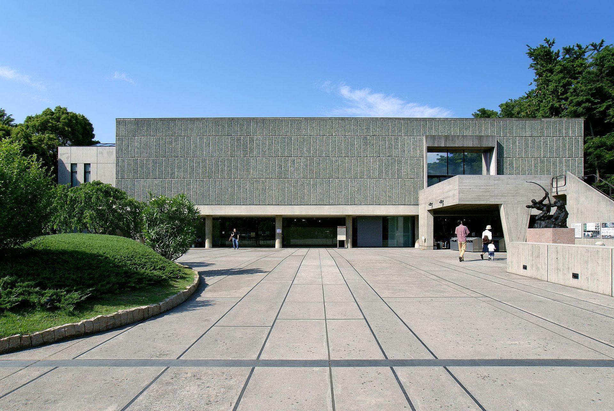
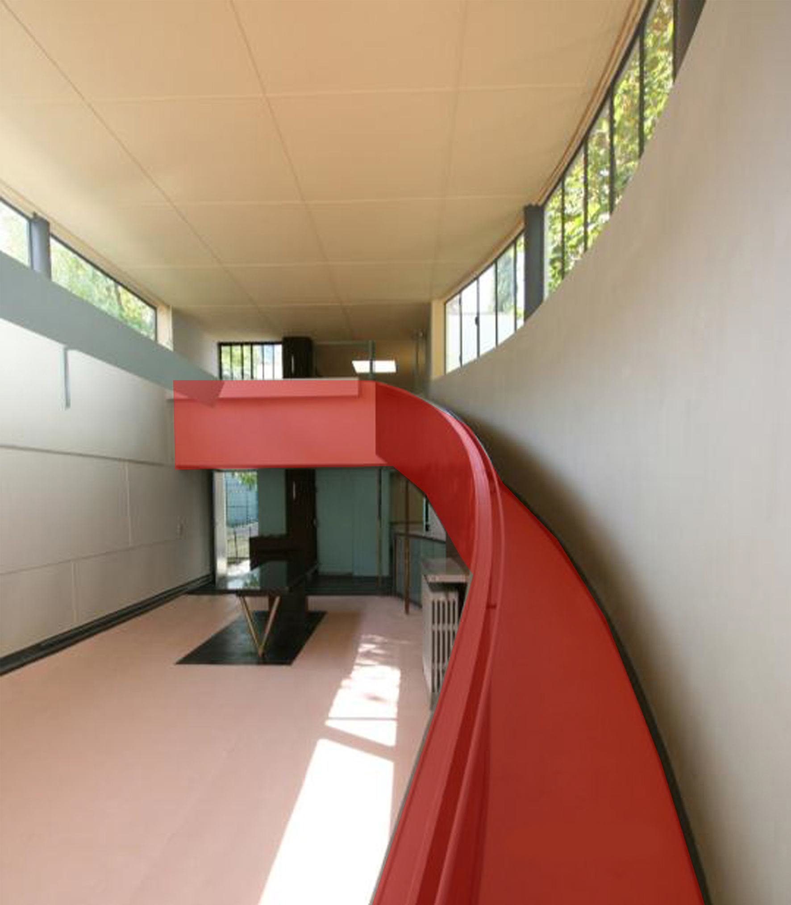
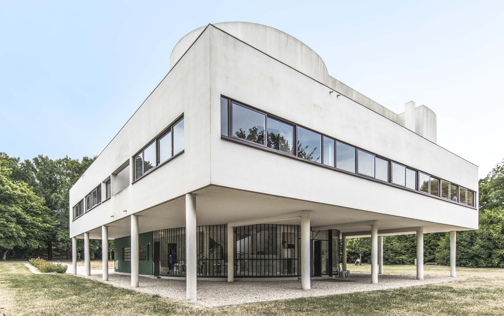
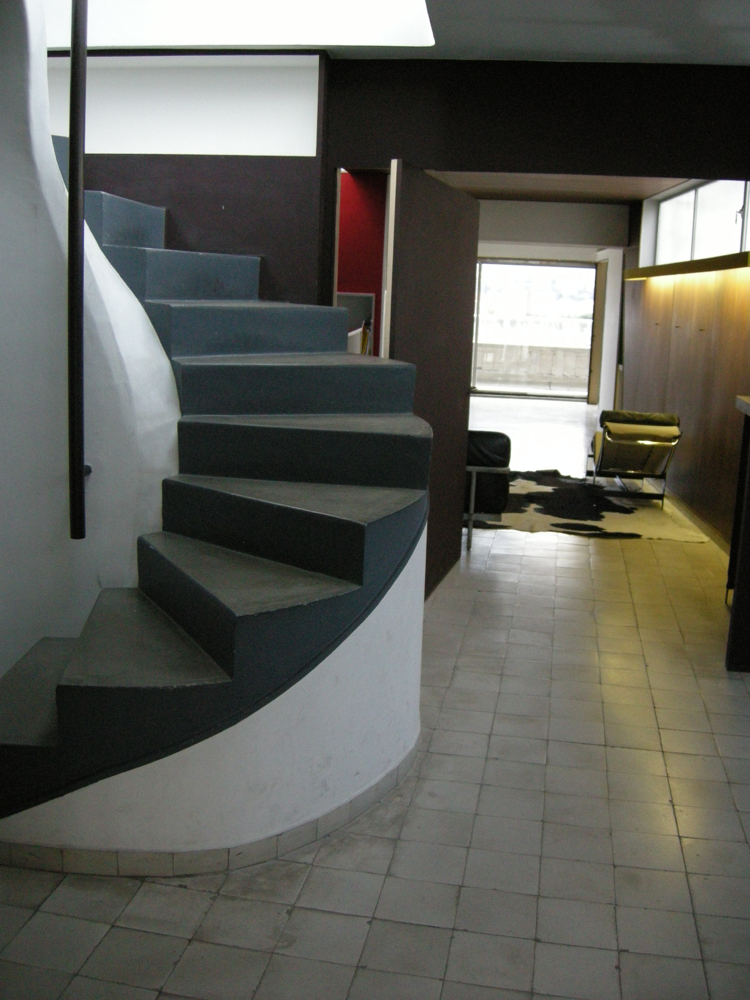
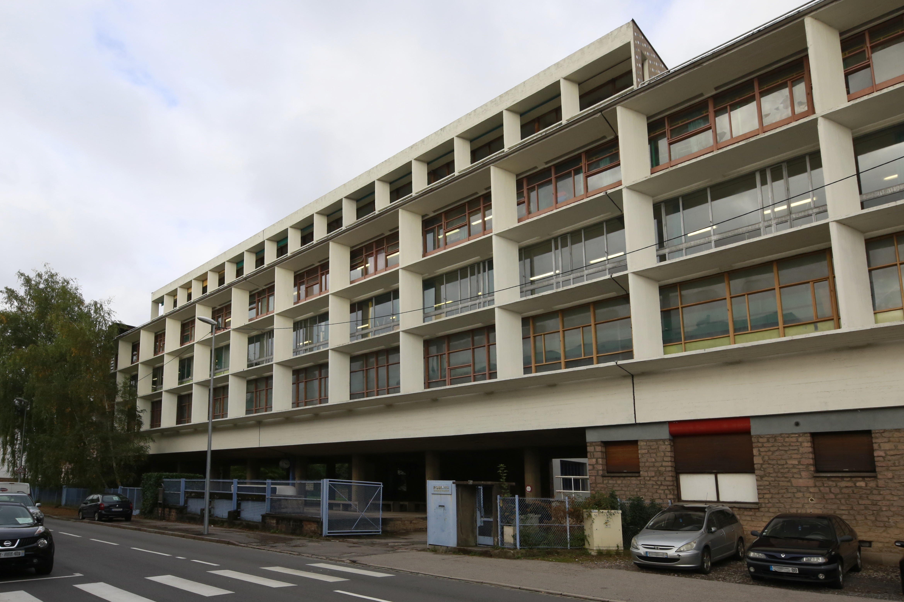
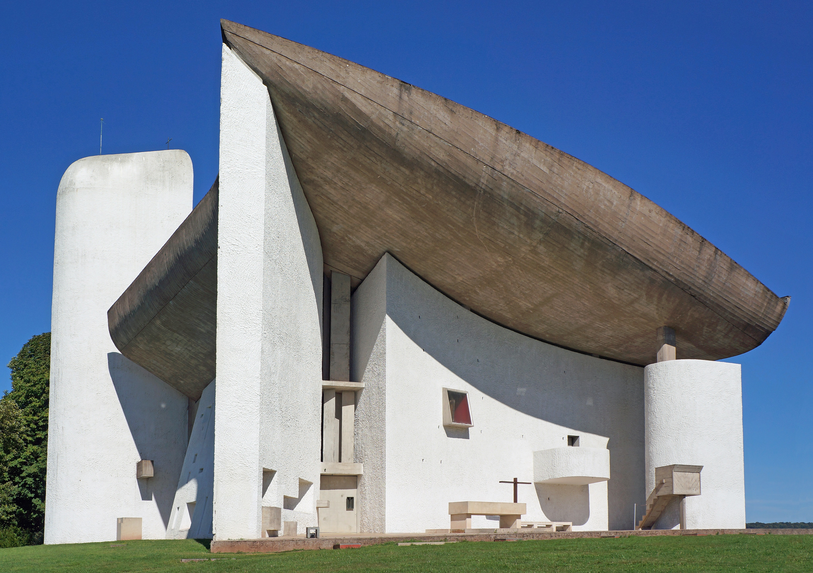
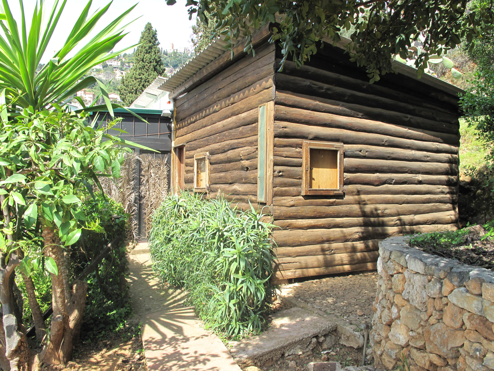
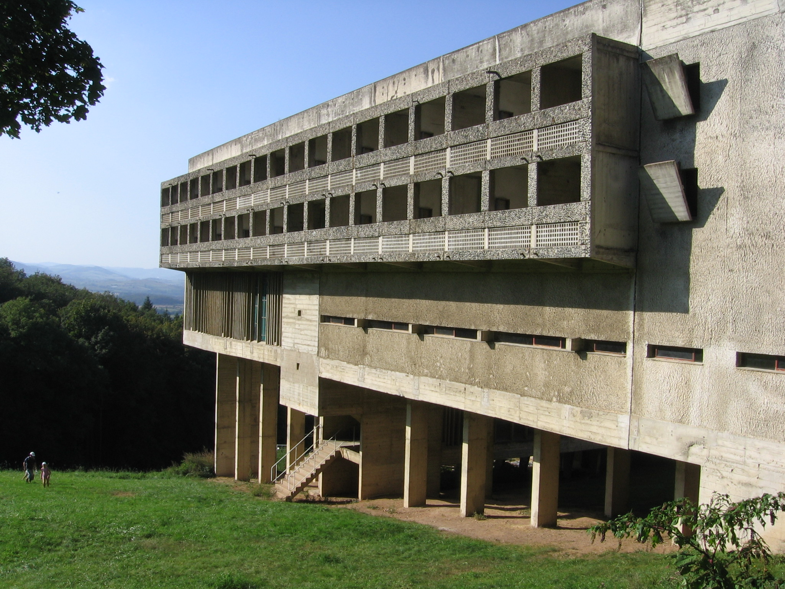
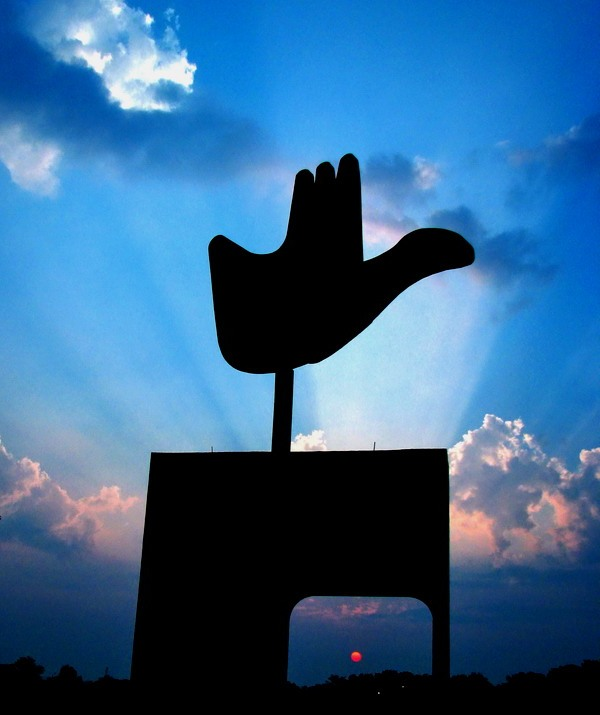
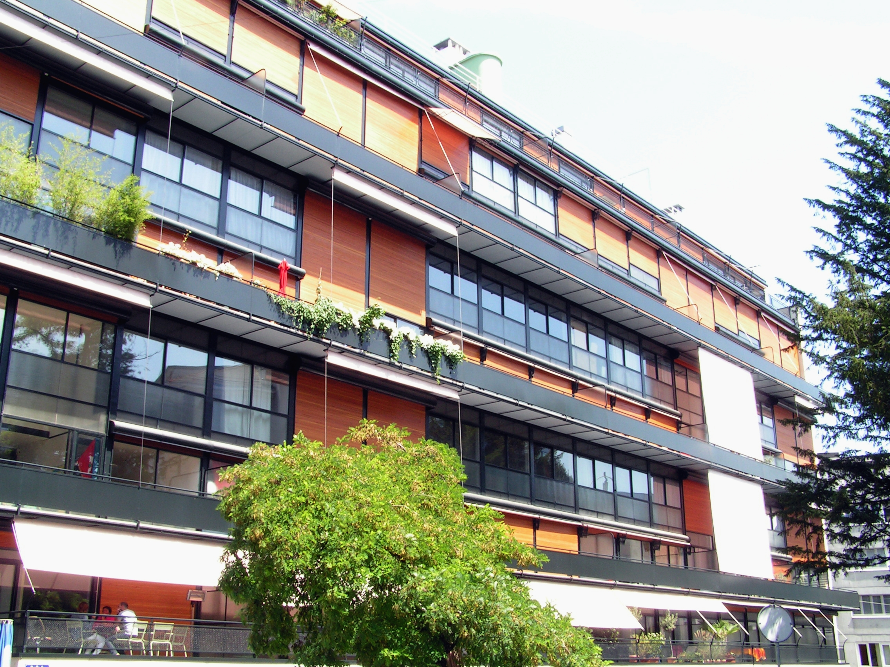

# Re:Earthチュートリアル「ル・コルビジェのアーカイブ」
## 概要
.jpg)
ル・コルビジェ（1887〜1965）は、スイス生まれ、モダニズム建築の巨匠として、フランスで主に活躍した建築家である。ル・コルビジェの建築作品群は、「ル・コルビュジエの建築作品-近代建築運動への顕著な貢献-」として世界遺産に登録されている。今回のチュートリアルでは、ル・コルビジェの建築作品と、ル・コルビジェの経歴のデジタルアーカイブを制作します。

## 流れ
ル・コルビジェの建築作品と、ル・コルビジェの経歴をマッピングする。  
1. ピンをたてる  
2. フォトオーバーレイ  
3. ストーリーテリング  
4. タイル地図を変更する
5. 公開設定  

## 素材

### ル・コルビュジエの建築作品-近代建築運動への顕著な貢献-

- 国立西洋美術館  
緯度軽度:35.715415, 139.775844  

国立西洋美術館（1955年）は、東京都台東区に残る美術館で、ル・コルビュジエが基本設計を担当した。日本に残る唯一のル・コルビュジエの建築というだけでなく、東アジアでも唯一である。  
国立西洋美術館は、フランスから松方コレクションが寄贈返還されるにあたり、その受け入れ先となる美術館の建設が必要となったことから実現した。ル・コルビュジエが指名された詳細な経緯は不明だが、1953年12月に日本で発足した「仮称フランス美術館設置準備協議会」では、フランス側の心証を良くするためにフランスの著名な建築家を起用することや、この機会に世界的建築家の作品を日本で実現したいといった意見が出ていたという。  
ル・コルビュジエが契約していたのは美術館の基本設計のみで、具体的な寸法なども含めた実施設計は日本の坂倉準三、前川國男、吉阪隆正の3人が担当した。ル・コルビュジエは生涯でただ一度となる日本訪問（1955年11月）を踏まえて、基本設計を行なった。その際には、坂倉の要請に応じて、契約外であった美術館周辺の総合的なプランも設計し、演劇ホールと展示館も含む広大な文化広場を構想した。  
しかし、当時の日本には美術館以外を建設する余力はなく、それらが建設されることはなかった。建設に当たっては、モデュロールを積極的に取り入れる形で寸法が決められ、1958年3月21日に起工式、それからほぼ1年後に竣工となった。  
国立西洋美術館はル・コルビュジエの無限成長美術館構想に沿って建てられたものであり、その構想で重視されていたにもかかわらず、インドの2つの美術館が実現していなかった中3階を利用する照明の配置を、唯一実現した美術館でもある。その一方、敷地の制約などから、インドの2つの美術館よりも若干規模が小さくなった。また、増築の必要に迫られた時も、本来の構想ならば本館を拡延していく形で対応すべきであったが、実際には新館の建設などによって対応された。  
日本の文化財保護法では、築50年を経過していないと重要文化財にはなれない。フランス政府から暫定リスト入りの正式な打診を受けた時点（2007年9月）では、それに1年余り及ばなかったが、同じ年の12月に特例として重要文化財指定を受け、国内法による保護を受けていなければならないという世界遺産の推薦要件を満たした。  
2009年の推薦時にはサン・ディエの工場とともに「標準大型建築」に分類されていた。これに先立ち、文化庁はチャンディガールやアーメダバードの美術館との比較を行い、前述の実現されなかった要素があるインドの美術館と比べて、国立西洋美術館はより完成度が高いとしていた。また、2009年の情報照会決議を受けて、推薦書では無限成長美術館構想に従った代表例であることを強調するとともに、前川國男らを挙げてル・コルビュジエが日本に与えた影響についても追記するなどの対応を行なった。  
しかし、2011年のICOMOSの勧告では、国立西洋美術館に基準 (2) と (6) を適用しうる潜在的な可能性はあるものの、チャンディガールやアーメダバードの美術館との比較がなおも不足しており、価値の証明が不十分であると指摘された。しかしながら、更なる修正を経た3度目の推薦ではその価値を認められ、世界遺産リスト入りを果たした。構成資産として評価されたのは、無限成長美術館構想のプロトタイプを実現した建物であり、ル・コルビュジエ建築の日本における受容を示し、ひいては「近代建築運動の国際化の過程を証言する」点にあった。
https://www.youtube.com/watch?v=bI3DeLgM9wA
  

- ヴァイセンホフ・ジードルングの住宅  
緯度軽度: 48.8005, 9.177667
   
ヴァイセンホフ・ジードルングの住宅（1927年）は、ドイツのシュトゥットガルトで1927年に開催されたジードルングの住宅展に出展された住居である。主催者のドイツ工作連盟の責任者ミース・ファン・デル・ローエの希望でル・コルビュジエが招聘され、それに応えて彼は1世帯用と2世帯用の2軒の住宅を建てた。彼は前年に「近代建築の五原則」を打ち出しており、ヴァイセンホフの住宅群にはその要素を見出すことが出来る。彼は空中に浮かんでいるかのような直方体をこの建物で本格的に実現させた。ただし、すぐ後に続くサヴォア邸（1928年）と異なり、背面に回るとありふれた壁面しか見えなくなる。この点で、同じ「空中の直方体」でも、ほぼどの方向からもそれが強調されるサヴォア邸とは趣きが異なっている。建設当初、その空中の直方体などに対し、非現実的あるいはロマン的すぎるデザインであるとか、不自然な形態の強要であるといった批判が寄せられた。また、出展された17人の作品のうち、単位面積あたりの建築費が最高額となった点も、想定する顧客の社会層の点で批判された。  
2009年の推薦時には「規格住宅」に分類されていた。世界遺産の構成資産として評価された点は、「大量生産のために構想された量産住居」の顕著なモデルである点、「住居をテーマとする表明の国際的反響によって」「地球規模の影響を与えた」点である。

- クルチェット邸  
緯度軽度: -34.911389, -57.941944  
  
クルチェット邸（1949年）は、アルゼンチンのブエノスアイレス州の州都ラ・プラタに建てられた邸宅である。依頼者のペドロ・ドミンゴ・クルチェット (Pedro Domingo Curutchet) は外科医であり、邸宅は住居と診療所を兼ねている。ル・コルビュジエの建築は世界各地に現存するが、南アメリカ大陸で実際に建てられた住宅は、このクルチェット邸が唯一である。アルゼンチンの建築家アマンシオ・ウィリアムス (Amancio Williams) がその建設に大きく寄与し、ウィリアムスの離脱後はサイモン・ウンガース (Simon Ungars) が協力した。住宅密集地の、広いとはいえない敷地でアルゼンチンの暑い気候に対応させるため、ブリーズ・ソレイユ（日除け格子）に工夫を凝らし、陰が出来る中庭の周囲に建物をU字型に配置する地元特有のスタイル（ル・コルビュジエはこれを「ソーセージ」と呼んだ）を取り入れた4階建てにするなどの配慮が行なわれている。  
2009年の推薦時には「個人邸宅」に分類されていた。世界遺産の構成資産として評価されたのは、地球規模で影響したル・コルビュジエの建築の中で、「第二次世界大戦後の近代建築運動の国際化の状況を説明し得る」点であった。

- ギエット邸  
軽度緯度: 51.183667, 4.39325  
  
ギエット邸は、ベルギーのアントウェルペンで1926年から1927年にかけて、画家ルネ・ギエットの依頼で建てられた邸宅である。せまい敷地の中で建造された3階建ての箱型住宅は、ヴァイセンホフの住宅とともに、シトロアン住宅の構想に比較的忠実に建てられた数少ない例と認識されている。近代建築の五原則の「自由なファサード」の典型とも言われるファサードを持つが、その左右非対称の窓をはじめとするファサードの構成や色彩に関する特徴として、当時のオランダの芸術運動であり、幾何学的抽象芸術を志向するデ・ステイルの影響が指摘されている。ことに色彩については、ル・コルビュジエは唯一の現地訪問の際に詳細に色番号の指定を行うという形で、強いこだわりを見せた。  
2009年の推薦時には「アトリエ」に分類されていた。これはピュリスムがフランス以外の地で適用された最初の事例であって、世界遺産の構成資産として評価されたのは、まさにスイス・フランス以外での最初の依頼によるこの邸宅が、「早い時期のル・コルビュジエのヨーロッパ地域における認知」を示す点である。

- ラ・ロッシュ＝ジャンヌレ邸  
緯度軽度: 48.8484, 2.2652  

ラ・ロッシュ＝ジャンヌレ邸は1923年から1925年に建てられたパリの2世帯住宅で、現在はル・コルビュジエ財団の本部が入っている。晩年のル・コルビュジエは、自分にとって重要だった邸宅として、この建物を挙げていた。依頼主は『レスプリ・ヌーヴォー』誌の支援者でもあった銀行家のラウル・ラ・ロッシュ (Raoul La Roche) と、ル・コルビュジエの実兄にあたる音楽家アルベール・ジャンヌレ (Albert Jeanneret) である。ラ・ロッシュは終始ル・コルビュジエと良好な関係を保った顧客であり、この建物もル・コルビュジエは自由に建設することが出来た。ル・コルビュジエが近代建築の五原則を発表するのは1926年のことだが、この建物ではそれに先立って水平連続窓が実現している。この点は、ラ・ロッシュ＝ジャンヌレ邸の重要性として、しばしば指摘されている。  
内部では、シトロアン住宅を基調として、吹き抜けのあるホール、緩やかに湾曲した壁面やそれに付随するスロープなど、多彩な空間が展開している。ル・コルビュジエ自身は、こうした空間の多様性を「建築的プロムナード」と呼んでおり、建物の中を歩いて新しい表現の数々を鑑賞することに特色があるとしていた。その一方で、様々な要素を盛り込んだことで、かえって全体としての印象が、部分ごとの印象に比べて不鮮明になっているという指摘もある。  
2009年の推薦時には「個人邸宅」に分類されていた。世界遺産の構成資産として評価されたのは、これが「建築における初めてのピュリスム表現」を実現した建築という点である。

- ペサックの集合住宅  
緯度軽度: 44.799, -0.6477
  
ペサックの集合住宅（1924年）は、ボルドー近郊のペサックに実現した集合住宅である。シテ・フリュジェ (Cité Frugès) やフリュジェ近代街区 (Quartiers Modernes Frugès) などとも呼ばれる。1924年に、製糖工場の経営者であり、ル・コルビュジエの著作『建築をめざして』に共感していたアンリ・フリュジェの要請で建設された。フリュジェは工場労働者向けの住宅を多く建てることを望み、ル・コルビュジエはその建設に当たってシトロアン住宅の理念などにも通底していたテイラー主義的様式を適用した。箱型住宅は、側面上部に突き出た階段がアクセントとなっている。それは幾何学的デザインに人の動きを暗示する要素を加えて外観の変化を生み出そうとする試みであり、ル・コルビュジエの初期の構想にしばしば見られるものである。ル・コルビュジエはスケッチなどに箱型住宅が並ぶ都市景観を描くことがあったが、ペサックの集合住宅はそれを実現させた稀有な例である。もっとも、ペサックには当初135戸が建設される予定だったが、実際には46戸にとどまった。景観に対する保守的な考えを持つ人々の干渉があったことや、現地の業者を起用しないことによる摩擦などによって、水道がなかなか整備されないなどのトラブルがあったのである。また、ル・コルビュジエのこだわりによって建設費も大きく跳ね上がり、労働者住宅としては不適切な入居費になるなどして、実際に労働者が住む住宅街になるのには、賃料について配慮したルシュール法（1929年）の成立を待つ必要があった。人が実際に住むようになると、住民たちによってボルドー一帯に特有の屋根などを付け加えようとする動きも多年にわたって続いたが、現在は当初の姿に復元されている。  
2009年の推薦時には「規格住宅」に分類されていた。世界遺産の構成資産として評価されたのは、建てられた1920年代という時代においては量産型住居による最大規模の街区であり、「近代住居による集合住宅のプロトタイプ」となった点である。

- サヴォア邸と庭師小屋  
緯度軽度: 48.924444, 2.028611  
  
サヴォア邸は、1928年から1931年にパリ郊外のポワシーに建てられた邸宅で、行政官のサヴォワ夫妻が週末を過ごす別邸として依頼した。この邸宅はル・コルビュジエの近代建築の五原則が集約された傑作として、高く評価されている。  
画像にもあるように、サヴォア邸を支える柱は細く、あたかも白い直方体が空中に浮いているかのような印象を与える。その直方体の下にある相対的に小さな1階部分は、車庫や使用人室などに当てられている。2階が主要な住居部分となっているが、そこは近代建築の五原則の一つである水平連続窓によって大きく開け放たれている。全面ガラス張りでなく、あくまでも窓とすることで、周囲の広大な草地との連続性を意識しつつ、そこから切り離された空中の直方体に囲まれているという感覚が得られるようになっている。3階部分は、これも近代建築の五原則の一つである屋上庭園が実現されている。この3階はスロープでつながれており、各階層ごとに全く異なる表情を楽しめるようになっている。ル・コルビュジエ自身が示していた見学プランは、最も外観が優れた北側から眺め、1階から入った後、スロープを使って2階、3階（屋上庭園）と順に見て回り、屋上庭園から1階まで続いている螺旋階段で降りるというものだった。ただし、屋根や庇を持たない直方体というデザインは、雨に弱いという欠点を持ち、サヴォワ夫妻が使い始めて間もなく、雨漏りに悩まされるようになったという。サヴォワ夫妻とル・コルビュジエの良好な関係は建築費が2倍に膨らんだ時点でも維持されていたが、雨漏りをはじめとする様々な不具合の顕在化によって、訴訟沙汰になりかけた。  
第二次世界大戦中にはナチスの干し草置き場に使われた。戦後に取り壊しが議論された時には、当時閣僚を務めていたアンドレ・マルローが保存を強く主張したことで取り壊しが回避され、段階的な修復を経て現在に至っている。  
2009年の推薦時には「個人邸宅」に分類されていた。2011年の推薦時には、19件の推薦資産の中で、提示されていた世界遺産登録基準 (1), (2), (6) 全てに当てはまりうる唯一の資産として、ICOMOSに認められていた。世界遺産リストへの正式登録においても、「近代建築運動の誰もが認める絶対的なイコン」と位置づけられた。  
なお、登録名にある「庭師小屋」は、同じ敷地内にある建物である。これは名前の通り庭師のために作られたもので、大きな邸宅と対をなす「最小限住宅」の実践例となっている。そして、その対比は富者と貧者の対比をも意味し、ル・コルビュジエの実践が万人に向けられたものであったことを示している。  

- ポルト・モリトーの集合住宅  
緯度軽度: 48.843333, 2.251389  
  
ポルト・モリトーの集合住宅は、1931年から1934年にかけてパリ近郊のブローニュ＝ビヤンクールに建てられた集合住宅である。一番上の2階分にはル・コルビュジエのアトリエと住居があり、生涯を通じた住居となった。外観はスイス学生会館などに類似するが、ブローニュの森に近いという立地から建物には地元の規制が多く加えられ、設計時点での構想に比べると、ファサードに示された創意は限定的になった。また、屋上部分のメゾネット構想が、入居者不足などによる資金難から中止されるなど、法規制以外の要因による変更箇所も存在している。内部については、入居者個人の住環境の向上のためにバス、キッチンなどに加え、セントラルヒーティングや地下ガレージを整備し、使用人の住環境にも配慮した。  
2009年の推薦時には「集合住宅」に分類されており、日本の文化庁はその時点では「ナンジュセール・エ・コリ通りのアパート」と呼んでいた（フランス語名は当時から変化なし）。これが構成資産に含まれた理由は、「全面ガラス張りファサードの世界で最初の集合住宅」だったという点である。

- ユニテ・ダビタシオン  
緯度軽度: 43.261323, 5.396261
  
マルセイユのユニテ・ダビタシオン（1945年）は、第二次世界大戦後の復興期に建てられた集合住宅である。ユニテ・ダビタシオンの住居部分の基本構造は、3階分を1つの単位としてL字型と逆L字型を組み合わせ、その間に廊下を挟むものである。断面図を模式的に示すと以下のようになる。   
模式図の水色、黄色の部屋は東西いずれかに窓が開いており、1日のうち、一定時間は日照を確保できる。また、吹き抜けのある居間を持つ2階建ての部屋という点ではいずれも変わらないが、水色の部屋は2階が広い構造なのに対し、黄色の部屋は1階が広くなっている。窓はブリーズ・ソレイユ（日除け格子）で、吹き抜けのある階とそうでない階で高さが変わるようになっており、それ自体が格子の内側の鮮やかな原色とともに、外観にアクセントをもたらしている。それらの部屋に挟まれている赤い部分が廊下で、3階分の構造につき1本の廊下が貫く形になっている。結果として15階建てのユニテには5本の廊下しか通っていない。この廊下は採光を意識した明るい部屋とは対照的に、構造上、日が差し込むことは無い。そのため、建設当初は衛生関係者から精神病の原因になるなどの批判が寄せられた。  
内部では、『輝く都市』で構想されたような「垂直の都市」となることが志向され、約1600人が暮らす住居だけでなく、生活に必要な各種施設が整えられたことも特徴である。2009年時点でも、ホテルやスーパーマーケット、幼稚園、屋上プールなどが存在しており、ほかにスポーツジムもある。内部に関しては、ル・コルビュジエが提唱していた寸法「モデュロール」がもっとも厳格に適用された例という点も特徴的である。それらはピロティによって空中に持ち上げられているが、スイス学生会館の飯盒のような柱とは違い、逆三角形の重厚な柱が支えている。これは視覚的な効果から選ばれた形で、構造上はもっと細くても支えられるため、空洞の内部には各種の配管が通っている。  
マルセイユのユニテは本来4棟建てられる予定だったが、実際には1棟しか建てられることはなかった。結果として、広大な緑地に4棟のユニテが点在してそびえるという彼のイメージは実現しなかったが、それでもその評価は高く、他の都市にもユニテ・ダビタシオンは建てられた。しかし、後続のユニテはいずれも簡略化された要素を含み、マルセイユのユニテが最高傑作とされる。のみならず、ル・コルビュジエ作品全体の中でも、これを最高傑作と位置づける者たちが多くいる。  
2009年の推薦時には「集合住宅」に分類されていた。2011年の推薦時には、ICOMOSから世界遺産基準 (2) と (6) について「顕著な普遍的価値」を認めうると指摘された。構成資産として評価された点は、「建築のブルータリズムの基点となる作品」という点および「独立性と共同性の調和を作り上げた新しい住居の方式の主要な試み」という点である。  
[https://www.youtube.com/watch?v=VusBebLi1xM](https://www.youtube.com/watch?v=VusBebLi1xM)

- サン・ディエの工場  
緯度軽度: 48.29082, 6.95025
  
サン・ディエの工場は、1946年から1951年にかけてアルザス＝ロレーヌ地方の都市サン＝ディエ＝デ＝ヴォージュに再建されたメリヤスなどの織物工場である。ユジーヌ・デュヴァル (Usine Duval, デュヴァル工場)、クロード & デュヴァル工場とも呼ばれる。ル・コルビュジエは戦後復興のための都市計画に参画することを期待し、複数の再建案を作成していたが、ひとつも実現されることはなかった。サン・ディエの再建計画もそのひとつで、ユニテ・ダビタシオンや無限成長美術館などを配置した包括的な都市計画を構想していた。サン＝ディエのジャン・ジャック・デュヴァルは、実現しなかったル・コルビュジエの都市計画を支持していた人物であり、自身が持っていた工場が第二次世界大戦で破壊されたことから、その再建をル・コルビュジエに依頼した。デュヴァルからは、機能的な工場を要望されたことから、ル・コルビュジエはピロティのある1階部分を原料の保管庫および製品の荷造り場所とし、3階を原料の裁断場所、2階を主たる作業場とした。これによって、1階から3階に運び上げられた原料が裁断されて2階に下ろされ、そこで縫製、仕上げ、アイロン掛けなどが行われた後に、1階に下ろされて包装されるという手順で作業が進められるようになっている。その一方で、彼はそれ以前の「暗黒の」工場と対比し、労働者たちの環境を改善した「緑の」工場という概念を打ち出した。木製の建具を取り入れた工場の周囲には緑が茂り、作業場の窓からは聖堂が見えるように配慮されている。その窓は室内に光を多く取り込めるようになっている一方、ブリーズ・ソレイユをヨーロッパで導入した初期の試みにもなっている。また、彼はその建設に当たって、船舶のイメージを取り入れ、そこからの隠喩を造形に投影させた。  
2009年の推薦時には「標準大型建築」に分類されていた。世界遺産の構成資産としては、「『輝く都市』と『アテネ憲章』における標準形」と位置づけられ、「労働状態に革新性をもたらす緑の工場のプロトタイプ」という点が評価された。

- ロンシャンの礼拝堂  
緯度軽度: 47.704547, 6.620578  
  
ロンシャンの礼拝堂は、1950年から1955年にオート＝ソーヌ県ロンシャンに建てられた礼拝堂で、「ノートルダム＝デュ＝オー礼拝堂」が正式名である。ロンシャンの小高い丘は古来神聖な場所されていて、以前は教会が建てられていた。その教会が第二次世界大戦で破壊されたことから、聖職者アラン・クチュリエの依頼で、ル・コルビュジエが新しい礼拝堂を建てることになった。ル・コルビュジエが実現した礼拝堂は、カニの甲羅をモチーフにしたと自身が述べた屋根に見られるように、以前の「透明な箱」がらは隔たった造形をしている。しかし、それらにはミサを行う場としての音響効果を考慮した凹んだ壁面や、高地で水の確保が重要であることから雨水を溜められるように中央が落ち込んでいる天井など、機能性を織り込んだ結果も含まれている。また、内部の採光には、闇を効果的に使ったジャウル邸の空間に通底する要素が指摘され、壁面に以前の教会の瓦礫を活用していることは、ドミノシステムの理念にもつながると指摘されている。  
後期の最高傑作と目される建物である一方、建設当初はその特異なデザインについて否定的評価も受けた。しかし、どちらの立場からも何故そう言えるのかについて、具体的な根拠が十分に示されてきたとは言いがたく、むしろそのような得体の知れない問いかけを見る者に投げかけること自体に、傑作としての価値を認める見解もある。建築家の槇文彦が解釈を示した時にも、謎のままであり続けることへの期待感が併せて示されていた。  
2009年の推薦時には「宗教建築」に分類されていた。2011年の推薦時には、ICOMOSから世界遺産基準 (1) について「顕著な普遍的価値」を認めうると指摘された。世界遺産の構成資産としては、「二〇世紀の宗教建築にとって革命的であり、キリスト教建築のイコンである」という点が評価された。

- カップ・マルタンの休暇小屋  
緯度軽度: 43.76, 7.463333  
  
カップ・マルタンの休暇小屋（1951年）は、地中海に臨むロクブリュヌ＝カップ＝マルタンに建てられた休暇小屋（カバノン）で、妻イヴォンヌに贈られた。イヴォンヌはカップ＝マルタンから5 km 程の場所に位置するマントンの出身で1957年に歿したが、ル・コルビュジエはその後もこの休暇小屋にしばしば立ち寄り、1965年8月に付近での海水浴中に心臓発作で亡くなった。近くにはイヴォンヌの死に接してル・コルビュジエが設計した彼女と自身の墓碑が残る。ル・コルビュジエは、地元のレストラン・オーナーのトマ・ルビュタートのためにいくつかの建物を建てたことと引き換えに、レストランと隣接する土地を提供された。休暇小屋はその土地を利用して建てられた。底辺は3.66 m四方、内部の天井までの高さは2.66 m というコンパクトな丸太小屋であり、その中に様々な家具調度類が配置されている。これは、彼が規定したモデュロールの厳密な適用であると同時に、彼が構想していた「最小限住宅」の実践でもある。  
2009年の推薦時には「規格住宅」に分類されていた。日本の文化庁は当初「カップ・マルタンの小屋」と訳していたが、後に現在の呼び方に修正された。世界遺産の構成資産としては、「人間工学と厳格な機能主義者としてのアプローチをもとに到達した最小限空間の原型」と位置づけられ、「総合芸術作品」とも評されている。

- ラ・トゥーレットの修道院  
緯度軽度: 45.819444, 4.6225  
  
ラ・トゥーレットの修道院（1953年）は、ローヌ県のエヴーに建設された修道院で、正式には「サント＝マリー＝ド＝ラ＝トゥーレット修道院」という。ドミニコ会の神学生のために建てられたもので、ロンシャンの礼拝堂と同じく、アラン・クチュリエの推薦によって実現した。ロンシャンの礼拝堂を踏まえた様式を含む一方、修道士の居住性にも配慮し、ユニテ・ダビタシオンの様式も踏まえ、宗教建築と集合住宅を調和させた建築を実現した。大型建築としては唯一、ル・コルビュジエの構想が何の修正や反対も受けずに実現した修道院である。予算的な制約から仕上げなどは省略されたが、意図的に斜面に建設し、最上階の修道士向けの個室に開放性を、半地下の礼拝堂に閉鎖性を持たせるなど、空間設計に工夫が凝らされている。ことに礼拝堂は、天井の彩色された三本の円筒から差し込む光が、闇の中で原色の壁を効果的に照らし、見る者の本能に訴えかける光景を実現している。  
2009年の推薦時には「宗教建築」に分類されていた。2011年のICOMOSの勧告で「顕著な普遍的価値」を有する可能性を指摘された3件に含まれなかったが、そこで名前の挙がった3件に引けを取らない傑作としばしば評価されている。世界遺産の構成資産としては「近代建築運動の卓越した集大成」と位置づけられており、その根拠としては「ピュリストの形態を組み合わせ、ブルータリストのテクスチャーにより、住居という題材において革命的解決を導いた」ことが挙げられた。

- フィルミニの文化の家  
緯度軽度: 45.3833, 4.28916  
  
フィルミニの文化の家（1953年 - 1965年）は、ロワール県のフィルミニに建てられた文化・居住施設群、フィルミニ＝ヴェール (Firminy-Vert)の一部である。フランスの復興大臣だったこともあるフィルミニ市長ウジェーヌ・クロディウス・プティは、労働者の生活環境が悪化していた都市の改善のために、市街から離れた広大な敷地に「フィルミニ＝ヴェール」という新しい街区をつくることを構想した。ル・コルビュジエが依頼されたのは、その街区に建設するスタジアムと「文化の家」、ユニテ・ダビタシオン、サン・ピエール教会などであった。彼はそれらを一体のものとして構想し、より広い景観の中で位置づけた。彼の構想は生前に完成することはなく、ことにサン・ピエール教会は市長の交代による財政支出見直しの影響なども受け、長い間未完成のままになっていた。2004年にようやく工事が再開され、2006年に竣工した。30年以上を経てサン・ピエール教会が完成したことは、ル・コルビュジエ作品の世界遺産推薦の機運を高めたとも指摘されている。  
文化の家は、ル・コルビュジエの生前最後に完成した建築物で、ファサードや屋根の傾斜や湾曲は彫刻的と評されている。  
2009年の推薦時には「フィルミニの建築物群」(Site de Firminy-Vert)という名称で「都市計画」に分類されていたが、2011年の推薦時には、「フィルミニのレクリエーション・センター」と改称され、都市計画ではなく個別の建築作品として位置付け直された。2016年の正式登録では、さらにその中でも文化の家に絞り込まれた。その構成資産としての評価は、この建物がサン・ディエの工場同様にアテネ憲章と輝く都市のコンセプトを採用しつつ、「建築における近代の彫刻的形態を先取りするものであった」点にあった。

- チャンディガールのキャピトル・コンプレックス  
緯度軽度: 30.74, 76.79  
  
チャンディガールはインドのパンジャブ州の都市で、パキスタンの分離独立に伴って、以前の州都ラホールにかわって州都となった。しかし、当初はほとんど何もない状態で、ル・コルビュジエはインド高官の依頼で都市全体の計画を策定した。ル・コルビュジエは、格子状の規則正しい区画に商業地区、行政地区などを配置し、前者ではドミノ様式の建物を並べ、後者では傑作として評価される建物、特にアーチ状の空隙を持つ屋根とブリーズ・ソレイユが特徴的な高等裁判所、独特の形状の庇を持つ議事堂などを建設した。特に行政地区の建造物群が高く評価される一方、あまりにも合理性を重視しすぎる都市計画には批判も寄せられ、「失敗作」という酷評すら存在する。逆に、ル・コルビュジエ自身にとっても、制約や反対によって実現できなかった要素が多く、自身の手がけた都市としての不満も表明していた。  
とはいえ、チャンディガールは彼が数多く構想した都市計画の中で唯一実現したものであり、2009年の推薦案の段階では「公共建築」に分類されていた。2009年の正式推薦を前に辞退となったが、2016年審議に向けた推薦で復活した。その対象はチャンディガール全体ではなく、その行政地区の中心部、すなわち高等裁判所、議事堂、合同庁舎の3件の建物と、「開かれた手」をはじめとする4件の記念碑を含む地区である。世界遺産の構成資産として評価されたのは、「自由と近代性と開く国の独立を記念する」「記念碑的で彫刻的な主要な建築作品」という点である。

- レマン湖畔の小さな家  
緯度軽度: 46.4684, 6.82941  
  
レマン湖畔の小さな家は、ル・コルビュジエが1923年から1924年にかけて両親のために建てた名前どおりの「小さな家」で、長さは20 m、幅は3 m である。コンパクトな室内で快適に過ごせるように、室内の家具の配置などにも配慮され、来客時にベッドを隠せる間仕切りなども存在している。この建物は人間工学などに基づいて、空間の最小化と快適さの最大化を目指した「最小限住宅」である。  
南側には11 m の開口部があり、横長の窓になっている。これによって、大胆な採光と、そこから見えるレマン湖やアルプス山脈の借景が可能になったが、この窓の存在についてはオーギュスト・ペレとの「窓論争」（1923年）のテーマとなり、合理性や必然性を主張したル・コルビュジエと、水平窓が室内空間にもたらす要素を否定的に捉えたペレが対立した。竣工の数年後に漆喰にひびが入ったが、ル・コルビュジエはむしろ老朽化にどう対応するかの好機と捉え、金属製の波板で覆うなどの補修を行った。  
2009年の推薦時には「個人邸宅」に分類されていた。世界遺産の構成資産としては、「最小限住宅のアーキタイプ」という点が評価された。

- イムーブル・クラルテ  
緯度軽度: 46.2, 6.156667  
  
イムーブル・クラルテは、1930年から1932年にジュネーヴに建設された集合住宅で、ル・コルビュジエが最初に手がけたアパートである。エドモン・ヴァネールの要請で建てられた集合住宅で、各階には8つの部屋がある。それらは『輝く都市』で計画された特色、つまり可動する仕切り壁やビルトインの家具などを備えている。また、金属製造業者であった依頼者ヴァネールが協力をしたことから、この建物は初めてスチール・フレームが採用された。また、ガラス張りの南側には、陽射しをさえぎるための赤いブラインドが付けられていたが、ル・コルビュジエ自身は後に、この恒常的なブラインドをブリーズ・ソレイユの淵源のひとつとして挙げた。この集合住宅は、集合住宅のプレファブ化につながり、第二次世界大戦後に住居を大量に供給する必要が生じた際に向けて影響が大きかったとされる。  
2009年の推薦時には「集合住宅」に分類されていた。世界遺産の構成資産として評価されたのは、「近代高級住居のプレファブのプロトタイプ」という点であった。

### CSVデータ
ル・コルビジェの経歴

### タイル地図
### 背景地図
- OSM  
   
[https://{s}.tile.opentopomap.org/{z}/{x}/{y}.png](https://{s}.tile.opentopomap.org/{z}/{x}/{y}.png)  
- 地理院地図  
[https://cyberjapandata.gsi.go.jp/xyz/std/{z}/{x}/{y}.png](https://cyberjapandata.gsi.go.jp/xyz/std/{z}/{x}/{y}.png)

## 1. ログイン

## 2. 新規プロジェクト作成

## 3.ピンの立てる

## 4.フォトオーバーレイ

## CSVデータのインポート

## 公開設定